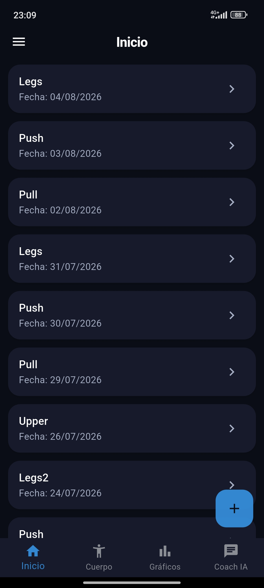
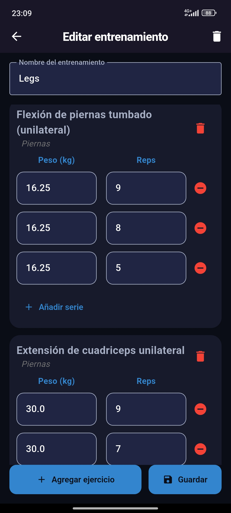
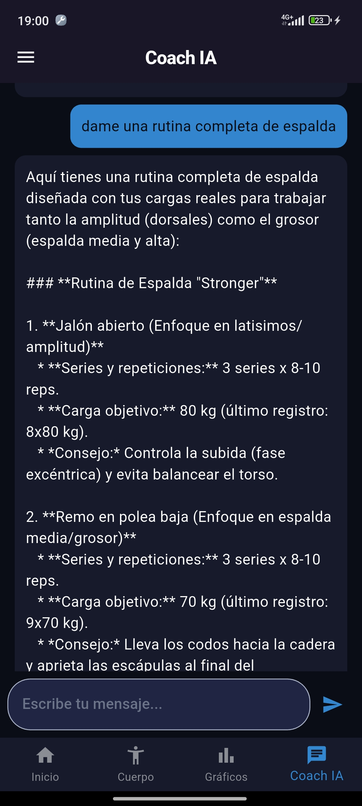
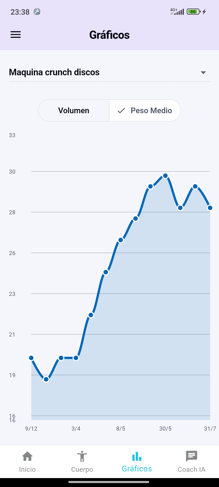
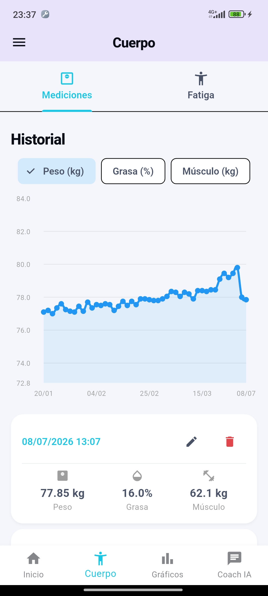
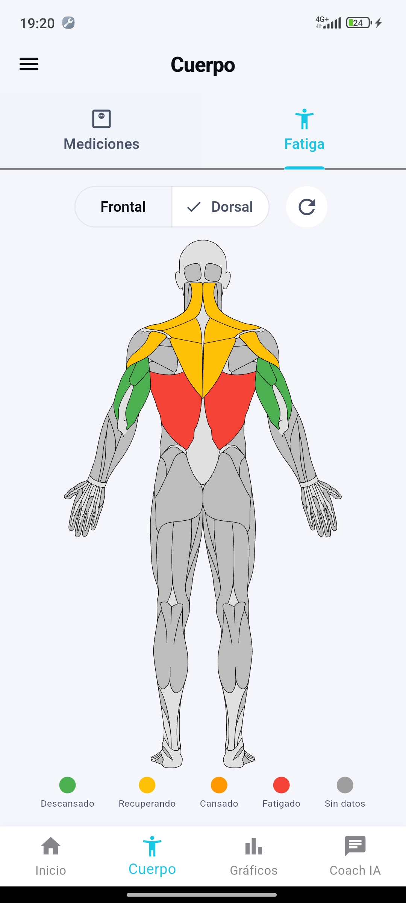

# 💪 Stronger — Fitness & AI Coach


[](https://github.com/marwix127/Stronger/actions/workflows/ci.yml)


Stronger es una aplicación Flutter para registrar entrenamientos, consultar la
evolución física y recibir orientación personalizada mediante Gemini. Está
planteada como un proyecto de portfolio: arquitectura clara, datos aislados por
usuario, tests automatizados y una integración de IA segura para aplicaciones
móviles.

## Capturas

|    Inicio     | Entrenamiento |    Chat IA    |    Progreso    |    Físico    |    Fatiga    |
|---|---|---|---|---|---|
|  |  |  |  |   |  |

## Funcionalidades

- Autenticación por email mediante Firebase Auth.
- Creación, edición e historial de entrenamientos con borradores locales.
- Catálogo base compartido y ejercicios personalizados aislados por usuario.
- Sugerencias de series basadas en el entrenamiento anterior.
- Gráficos de volumen, peso medio y composición corporal.
- Mapa corporal con estimación y recuperación progresiva de fatiga muscular.
- Coach contextual que analiza los entrenamientos y medidas del usuario.
- Eliminación de cuenta con borrado de entrenamientos, mediciones, fatiga y
  ejercicios personales.
- Tema claro y oscuro y navegación declarativa con GoRouter.

## Arquitectura de IA

```text
Flutter ── App Check + Firebase Auth ──> Firebase AI Logic ──> Gemini
   │
   └── Firestore: datos del usuario autenticado
```

La aplicación utiliza el SDK oficial `firebase_ai`. Las peticiones pasan por el
proxy de Firebase AI Logic, por lo que la credencial de Gemini no se incluye en
el código, APK o build web. La configuración elegida funciona con el plan Spark
y la cuota gratuita de Gemini Developer API.

Consulta [la guía de configuración de IA](docs/ai.md) para activar el servicio,
App Check y el modo de usuarios autenticados.

## Tecnologías

| Área | Tecnología |
|---|---|
| Aplicación | Flutter y Dart 3 |
| Autenticación | Firebase Auth |
| Base de datos | Cloud Firestore |
| IA | Firebase AI Logic + Gemini 3.5 Flash |
| Protección | Firebase App Check |
| Estado | Provider + ChangeNotifier |
| Navegación | GoRouter |
| Gráficos | fl_chart |
| Persistencia local | SharedPreferences |

## Puesta en marcha

La plataforma principal es Android. Para ejecutarla se necesita Flutter 3.44
(la versión usada en CI), el Android SDK y un dispositivo o emulador disponible.

```bash
git clone https://github.com/marwix127/Stronger.git
cd Stronger
flutter pub get
flutter devices
flutter run -d DEVICE_ID
```

El repositorio incluye la configuración nativa Android/iOS del proyecto usado
para la demo. Para conectar un fork a otro backend hay que crear un proyecto
Firebase, habilitar el acceso por email en Authentication y Cloud Firestore y
regenerar la configuración:

```bash
npm install --global firebase-tools@15.17.0
firebase login
dart pub global activate flutterfire_cli
flutterfire configure
firebase deploy --project PROJECT_ID --only firestore:rules
```

Después se activa Firebase AI Logic y App Check siguiendo la
[guía de configuración de IA](docs/ai.md). No se necesita `variables.env`, una
API key de Gemini ni Firebase Cloud Functions. Los identificadores y API keys
de cliente generados por FlutterFire identifican el proyecto Firebase, pero no
son credenciales secretas de Gemini.

### Plataformas

| Plataforma | Estado |
|---|---|
| Android | Plataforma principal; compilación y E2E automatizados en CI |
| iOS | Configuración nativa incluida, sin validación automática en CI |
| Web, Windows y macOS | Requieren ejecutar `flutterfire configure` antes de usarse |
| Linux | Firebase no está configurado |

Web necesita además la clave pública del proveedor de App Check:

```bash
flutter run -d chrome --dart-define=RECAPTCHA_SITE_KEY=public_site_key
```

El repositorio no publica binarios y la firma Android de producción debe
configurarse antes de distribuir una versión release.

## Calidad

```bash
flutter analyze
flutter test
flutter test --coverage
flutter build apk --debug
```

La suite cubre modelos, servicios de Firestore, formateo seguro del contexto,
validación de respuestas estructuradas, recuperación de fatiga, aislamiento de
ejercicios personales y borrado de datos de cuenta.

Los flujos críticos se recorren además mediante un E2E Android aislado contra
Firebase Emulator Suite. Consulta la [estrategia de pruebas](docs/testing.md)
para ver su alcance, garantías de seguridad y ejecución local.

Las reglas de Firestore se validan contra el emulador real:

```bash
npm ci --prefix firebase-tests
npx --yes firebase-tools@15.17.0 emulators:exec --only firestore \
  --project stronger-rules-test "npm test --prefix firebase-tests"
```

Actualmente la suite Flutter contiene 168 tests unitarios, de widgets y de
flujo, con un 85,0 % de cobertura instrumentada. Se añade un escenario E2E
Android y 9 pruebas de reglas para acceso anónimo, aislamiento entre usuarios y
propiedad de los ejercicios personalizados.

GitHub Actions ejecuta en cada `push` y `pull request` el análisis estático, la
suite Flutter, un umbral mínimo del 80 % de cobertura, una compilación APK
debug, las pruebas de reglas y el E2E sobre un emulador Android limpio.

## Estructura principal

```text
lib/
├── models/                        # Entidades de dominio
├── infrastructure/services/
│   ├── firebase/                  # Auth y persistencia
│   ├── coach_service.dart         # Coach mediante Firebase AI Logic
│   └── muscle_fatigue_service.dart
├── UI/pages/                      # Pantallas
├── UI/widgets/                    # Componentes reutilizables
├── theme/                         # Temas claro y oscuro
└── router.dart                    # Rutas y protección de navegación
test/                              # Tests unitarios, de widgets y de flujos
integration_test/                  # Escenario E2E Android
firebase-tests/                    # Pruebas de reglas con Emulator Suite
firestore.rules                    # Autorización y aislamiento de datos
.github/workflows/                 # Integración continua
docs/                              # Configuración y material de portfolio
```

## Licencia

Distribuido bajo la licencia MIT. Consulta [LICENSE](LICENSE).
